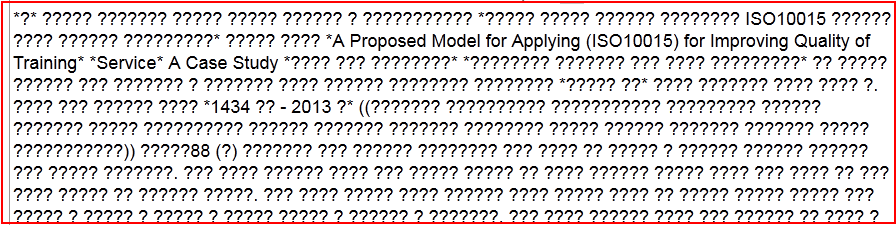
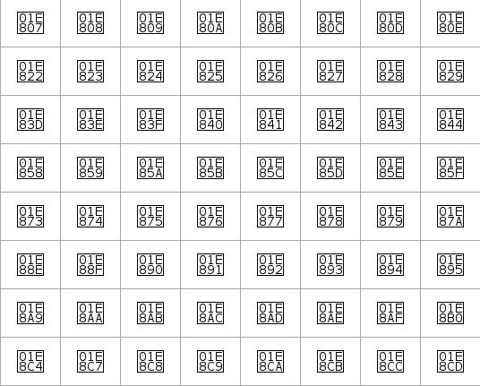

Basics of Internationalization
##############################

Internationalization can be further divided into two types. It is core internationalization and application internationalization.

Core internationalization is the support from platform for the application getting hosted on it. Platform here means an Operating systems. These support mostly comes in the form of api’s. This includes encoding conversions, fonts rendering libraries, locales and input methods.

Application internationalization is more in the form of developing application in a way to use i18n libraries provided by the platform and same time should be adaptable with minimum changes to the requirements of different regional languages.

Please note here Operating system itself is one kind a application and requires its own internationalization.

If one asked things that has helped to language computing world over the year, will say it’s standardardization.

- Many countries

- Many languages

- - Many languages uses multiple script for writing. Maithili language in India can be written by Devanagari, Tirhuta, Kaithi.

- Many scripts

- Many users

- Few languages are used across the borders.

- - Bengali is spoken in India as well in Bangladesh.

Just imagine how it’s difficult to get consensus. Thanks to all efforts that has been done by various companies and standardization organization for many year for getting consensus and developing standards suitable for all.

Encoding
********

Computer deals with binary !!

Everything we do is get stored in computer in binary. Without standard around encoding we
can’t do much things.

That is why in 1963 during the start of computing era ASCII (American Standard Code for Information Interchange) was standardized. Earlier ASCII was 7-bit (0-127) later it further extended for 8-bit and few other language characters were added from 128-255.

Main intention behind encoding standard was portability of data across computers.

Multiple uses of extended ASCII:

Based on extended ASCII, other countries started creating their own encoding standards to accommodate respective scripts characters. Few of those are

- ISCII (India)
- VISCII (Vietnam)
- YUSCII (Yugoslavia)

All local encoding made sure to keep lower bit of ASCII 0-127 same as with original ASCII standard. Therefor no problem of encoding interoperability with English but with Data from 128-255 all encodings were incompatible.

Have you seen how does encoding issues looks like?

   Encoding issues

Above image is nothing but the typical example, where your data is created with different encoding but viewed or wrongly converted to incompatible encoding. Whenever one see this, first thing to check your encoding related stuff.

Unicode and ISO
===============

Incorporated in January, 1991 Unicode Consortium started to work on resolving problem of many encoding standards and incompatibility while transferring data from one computer to other.

Unicode started with simple mission

Unicode provides a unique number for every character,

no matter what the platform,

no matter what the program,

no matter what the language.

Unicode is huge each block of 16-bits and total 21 blocks. Total 21-bit. Most of the active scripts are covered in its first block i.e. 0000-FFFF

In the initial version Unicode identified all the encodings in the world and started providing different codes to it. Though It took long time but now Unicode is accepted globally.

During the same time ISO also started to standardize encoding for different encoding systems. They came up with ISO 10464. Presently both Unicode and ISO 10464 are in sync.

Unicode is huge resource for the world scripts knowledge. To get glimpse one should look into Unicode character database.

The most commonly used encodings of Unicode are:

1 UTF-32 

  This is 32 bit format. (UTF stands for Unicode Transformation Format). A character is represented as a 32 bit integer. This is the only UTF encoding which is fixed length, UTF-16 and UTF-8 are both variable length.

  In UTF-32, each 32 bit value represents one code point and is exactly equal to that code point’s numerical value.

2 UTF-16 This is a variable length encoding.

  A character is represented as one or two 16 bit integers.

3 UTF-8

  This is more interesting to understand. UTF-16 to UTF-8 conversion happens in following way.

Insert Table 

- Important point to note here, UTF-8 is backward compatible with ASCII. UTF-8 take same storage space as ASCII for English characters 1 Byte.

- This is more expensive for Asian script specifically in the range U+0800- U+FFFF since it takes 2 to 3 Bytes.

- One always wonders why to use multi-byte encoding when we can use either UTF-16 or UTF-32 directly but UTF16/UTF32 are easy for computation but are not efficient for storage.

- UTF-8 is a more popular encoding of Unicode and widely used than ASCII.

Byte order mark

This is special character in Unicode. U+FEFF. This character is special and provide
following information

- What is the byte order, or endianness, the text stream is stored in; 
- Confirmation that string is Unicode.

- Whether it is UTF8/UTF16 text?

-  - UTF8 - 0xEF,0xBB,0xBF

-  - UTF16 (BE) - 0xFE 0xFF

Other Encodings
===============

Though Unicode has became de-facto standard still some countries have mandated use of there custom standards. Following are the some list.

SJIS
----

Shift Japanese Industrial Standards

.. Add other Encoding information

Fonts
*****

How does your computer or any other digital device will looks without fonts?

   Text without fonts

Most of the platform's by default provide fonts for most of the actively used Unicode scripts. Mostly provides fonts for Basic Multilingual plane of Unicode (0000-FFFF). Still if anytime yousee characters like this or empty/cross square boxes instead of character, make sure you have fonts available for that script.

Basic Multilingual plane: This is first 0000-FFFF range of Unicode and it is used for actively used scripts and languages.

Open Type Fonts
===============

To handle these complexities Adobe and Microsoft together developed OpenType fonts format. This format provide more scope to font for embedding script sensitive data into it.

Open type fonts has more data rather than simple mapping of character image to code. This data includes substitution tables and positioning table. Rendering engine process GSUB and GPOS table provide final output onto screen. In rendering engine there is specific component called OpenType layout shaper (OTLS) which does this magic.

Web Fonts
=========

Multilingual websites were dependant on target platform for expected rendering of the websites. It was big issue and many times websites were not rendered perfectly and end-user need to download and install fonts.

Websites providing multilingual contents became more intelligent with the invention of Web

Fonts. When browsing website using Web fonts technologies fonts get loaded into your cache and you see text using download font rather than default fonts in system. As per platform we have different formats for Web fonts.

EOT

- Microsoft developed .eot (Embedded Open Type) for uses with internet explorer. Once can create this font with Web Embedding Fonts Tool (WEFT).

WOFF

- This is more popular. WOFF is Web open font format. Initial drafted by Mozilla Foundation, Opera Software and Microsoft. WOFF has been also recommended standard by W3C. This can be created from generated from wide variety of fonts editors and also utilities.

- One of the best thing from WOFF, it loads only characters required for rendering from
  font and save bandwidth.

Web fonts as a Brand
--------------------

Earlier intention of Web fonts were to remove TOFU from the Websites. In present generation with the technology improvements and more knowledge around fonts many web designers using it for uniquely styling Websites.

We do have Brand fonts now a days and those get used as a Web Fonts to provide unique styling for home web page.

Rendering Engines
*****************

For Latin script it is what you type that you see on screen. This case is not same for complex script like Indic, Arabic and many more.

Example In Indic scripts often,

- Typing 2-3 characters give you single character.
  -- क (u+0915) + ◌् (u+094D) + ष (u+0937) =

- Even characters get reordered. क (u+0915) + ि◌ (u+093F) = क

- Single characters get split into multiple part. ക (u+0D15) + െ◌ാ (u+0D4A) = െകാ

Arabic script brings different type of complexity. First it is written from Right to Left (RTL) and second it is cursive in nature.
Furhter it can be Naskh and Nastaliq. Naskh is linear cursive and Nastaliq is (Add Text)

   Arabic script Naskh

Uniscribe
=========

In Windows Uniscribe is OTLS and actual file name is usp10.dll. It has been treated as a reference implementation of Open Type specs. Though during the experience different versions of usp10.dll in same Operating system often caused different rendering experience in applications.

Example: Different usp10.dll in MS-Office and Windows OS.

Harfbuzz
========

In Linux harfbuzz has became de facto standard. Harfbuzz is compatible with Uniscribe and make sure to provide same processing to fonts as it does with Uniscribe. Compatibility between Uniscribe and Harfbuzz has made it possible to increase fonts portability across multiple platform. Harfbuzz is under more permissive Free and open source Apache license and any product can use it without restrictions.

Prior Harfbuzz, each rendering engine example, Pango, ICU and QT were having own codebase for OTLS, over the time it created big incompatiblity issues across rendering engines for processing of fonts. Fonts were not providing same results across rendering engines and platforms. Harfbuzz has significantly helped to make it uniform now.

ATSUI
=====

Apply has different complex script processing mechanism with  ATSUI (Apple Type Services for Unicode Imaging) library. ATSUI mechanism has provided more scope to make fonts more intelligent by embedding Finite state machines (FSM) into fonts. It create less dependency on rendering engine and more freedom of design and programming fonts as per required for typographers.

Locales
*******

What is locale?

Locale helps program to get into the environment required for particular countries and cultures. We have many different conventions need to get changed while running program into particular countries and culture. Like..

- Date and Time format

- Numeric format

- Data Sorting

- Expression of Yes/No. etc.

Locale provide this crucial data to program. During earlier days every OS has its own locale data. Like Glibc has its native Locale data, Microsoft had there own and so on. 

But with the start of Unicode CLDR data, most of the partner has been migrated to it.

Unicode CLDR
============

The term CLDR stands for common locale data repository and it provides key building blocks to support world languages in software. After first release in 2003 in present stage Unicode CLDR has became huge repository for World languages and its growing and growing. Unicode CLDR has been already used and supported by major software companies including Apple, Google, IBM and Microsoft.
