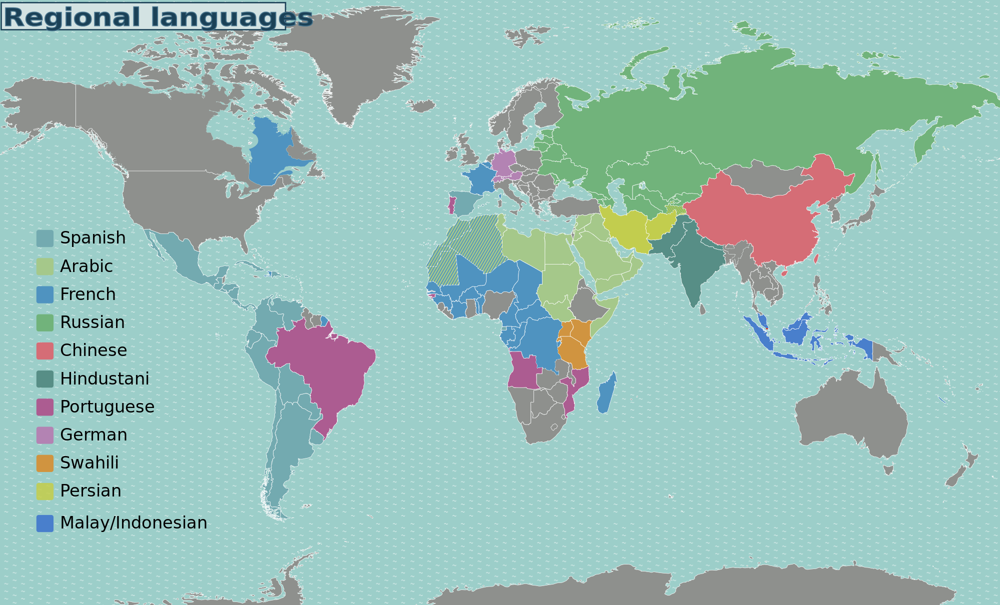

============
Introduction
============

Internationalization is not a new concept. From the time computer has invented thoughts were started regarding removing language barriers from it and making it usable for the whole world. Its general phenomenon as more and more people start using particular products, more ideas start getting generating on further better usage of product and further innovation around that product.

In fact same evolution has been happened with the computer and we are witnessing tremendous development around computing.

Few terms:

Internationalization (a.k.a i18n)
        Development of application in a way to make it adaptable to the requirements of different regionals and languages with minimal codebase change.

Localization (a.k.a l10n)
        Adapting application to the different regional and language requirement, mostly with translation. This is bit more than translation in some cases i.e. one might need to bring significant cultural changes to application looks, including Date, Time format, localization of images etc.

Globalization (aka g11n)
        There are numerous definition of globalization in different context. Internationalization and Localization together forms software globalization. This is more kind a strategy for launching i18n & l10n product into new market.

----------------------------
Need of Internationalization
----------------------------

Out of the entire world population 7+billion, only 341M people have English as their first language. Importance of English in global economies has increased number of fluent English speaker significantly. But one should note that, English is their second language. Major part of world still expect computing in there own language and script.

   
   World regional languages

This is described in more details in talk "Why globalization? World wide picture?”

.. TODO: We can add details from the presentation to this book.
