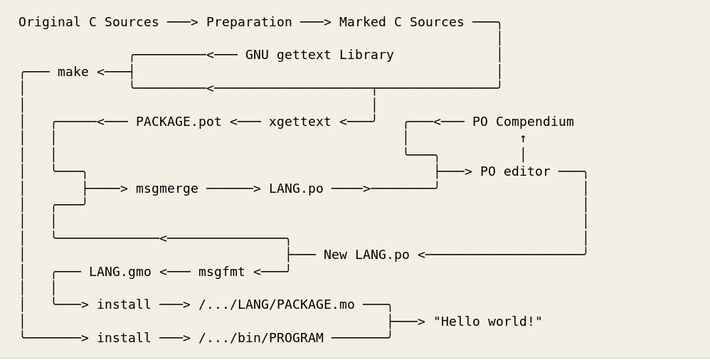

L10N string extraction frameworks
#################################

Gettext
*******

Prior to gettext framework, handling of translations related activities i.e. Extractions of string, replacing translated string with proper localized string during runtime was mostly handled by program itself.

It was adding one different complexity of writing internationalized program. In fact many applications were shipped for specific languages only. User need to download exact program for his language.

Concepts
========

As Gettext documentation says

*“GNU gettext is designed to minimize the impact of internationalization on program sources, keeping this impact as small and hardly noticeable as possible. Internationalization has better chances of succeeding if it is very light weighted, or at least, appear to be so, when looking at program sources.”*

Gettext provides

- A set of conventions about how programs should be written to support message catalogs.

- A directory and file naming organization for the message catalogs themselves.
  
- A runtime library supporting the retrieval of translated messages.
  
- A few stand-alone programs to massage in various ways the sets of translatable strings, or already translated strings.
 
- A library supporting the parsing and creation of files containing translated messages.
  
- A special mode for Emacs1 which helps preparing these sets and bringing them up to date.

Implementation

Following diagram provides list of all the utilities which used throughout implementation of gettext.

   
   Overview of gettext utilities

Extraction
==========

As information given in above diagram. Modifying source code as per requirement and guidelines given by gettext is first important change required from the developer.

Once marking source strings for translations is done, then gettext has provided number of tools which can be simply automate using Makefile. As shown in above block diagram

- **xgettext** - Extract translatable strings from given input files.
- **msgmerge** - For refreshing already generated .pot file without data loss.
- **msgfmt** - Generate binary message catalog from textual translation description.

In example of internationalization of Hello World i18n gettext has been used and it provides practical example of its implementation.

Installation of Gettext
=======================

Gettext is available across platforms.

**Fedora/Red Hat/Cent OS**

::

    [user@host]$ sudo yum install gettext

.. Note: yum has been replaced with dnf in recent versions

**Debian/Ubuntu**

::

    [user@host]$ sudo apt-get install gettext

**Windows**

Precompiled binaries are available for Windows at https://mlocati.github.io/articles/gettext-iconv-windows.html

Available in Shared and Static flavors. Where static means setup size is much bigger, but all the executables may be moved around as you like, no DLL-dependencies. Shared is smaller in size but all DLL must stay together.

**MacOS**

- Open Terminal

- Run:

::

    $ruby -e "$(curl -fsSL https://raw.githubusercontent.com/Homebrew/install/master/install)" -e "$(curl -fsSL https://raw.githubusercontent.com/Homebrew/install/master/install)" < /dev/null 2> /dev/null

    $brew install gettext

Detailed information available at http://macappstore.org/gettext/

XLIFF
*****

XML Localisation Interchange File Format. http://docs.oasis-open.org/xliff/xliff-core/v2.0/os/xliff-core-v2.0-os.html

*“XLIFF is the  XML Localisation Interchange File Format designed by a group of multilingual content publishers, software providers, localization service providers, localization tools providers and researchers. It is intended to give any multilingual content owner a single interchange file format that can be understood by any localization provider, using any conformant localization tool. While the primary focus is on being a lossless interchange format, usage of XLIFF as a processing format is neither encouraged nor discouraged or prohibited.”*

L20N
****

Stands for “L10N 2.0” developed by Mozilla. Its main core is users should be able to benefit
from the entire expressive power of the natural language and keeps simple things simple for
developer and at the same time makes complex things possible. Presently in used by Mozilla.

Qt translation tools
********************

This is bit similar to gettext but provide good utilities but this is only limited to QT framework
does not work outside.

Java properties
***************

This is .properties file extension also know as Property Resource Bundles. These files used to
store strings for localizations.

Windows resources
*****************

.Net and various Windows technologies use concept of resource file for localization of application.
